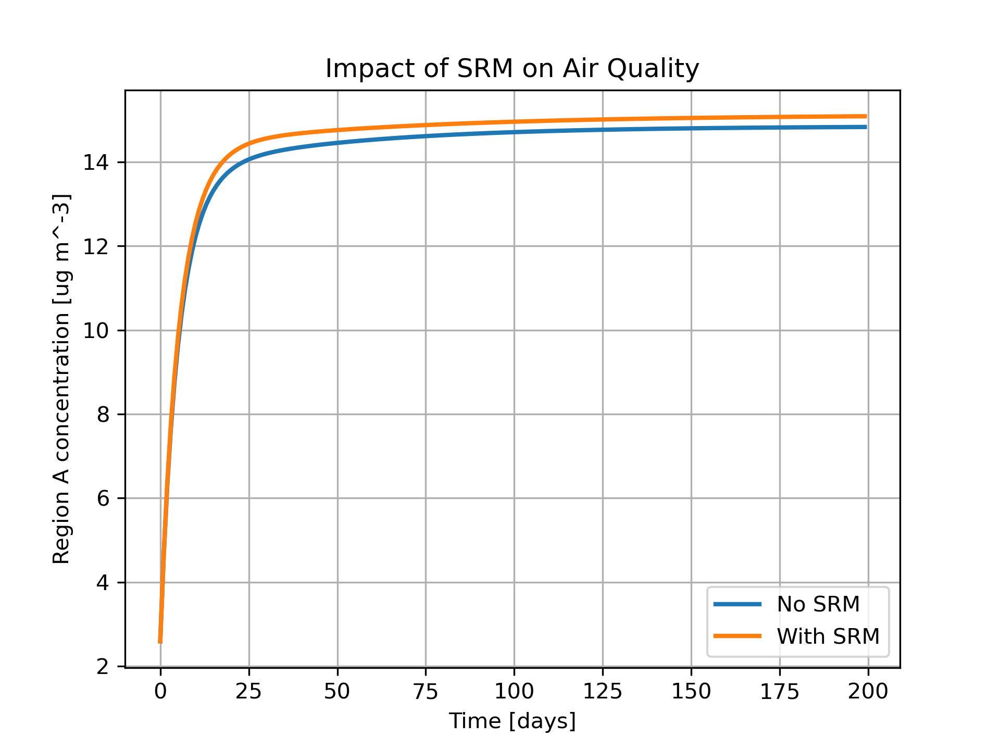
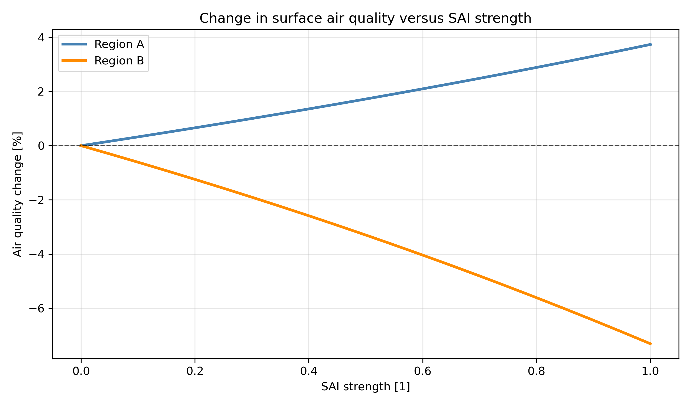

# SRM Air Quality First-Order Approximation Model

This repository contains a simplified, physics-informed first-order approximation model designed to explore how **solar radiation modification (SRM)**, specifically **stratospheric aerosol injection (SAI)**, may influence **air quality controllability**.

The model is inspired by current research questions in chemistry–climate and chemistry–transport modelling, particularly how changes in atmospheric circulation under SRM could alter the sensitivity of surface air quality to emissions.

---

## 🔹 Scientific Motivation

Stratospheric aerosol injection (SAI) introduces additional aerosols into the stratosphere, which can modify:

- Large-scale circulation (e.g. Brewer–Dobson circulation, QBO)
- Vertical and horizontal transport pathways
- Coupling between the stratosphere and troposphere

These changes may influence how surface pollution responds to emissions, especially in the context of **cross-boundary pollution**.

A key quantity of interest is:

```math
\text{Air Quality Sensitivity} = \frac{dC}{dE}
```

where:
- $C$ = surface pollutant concentration, in $\,\mathrm{kg\,m^{-3}}$  
- $E$ = emissions/source term, in $\,\mathrm{kg\,m^{-3}\,s^{-1}}$  

so the sensitivity $dC/dE$ has units of $\,\mathrm{s}$.

This determines how controllable air quality is via emission reductions.

For a longer conceptual explanation of the model assumptions, transport pathways, and physical interpretation, see [Physical Model Notes](physical_model.md).

---

## 🔹 Model Description

We implement a minimal two-region + stratosphere system:

- Region A → high emissions  
- Region B → low emissions  
- Stratosphere → mediates large-scale transport  

The governing equations are:

```math
\frac{dC_A}{dt} = E_A - \lambda C_A + k_h (C_B - C_A) + k_v (C_{\text{strat}} - C_A)
```

```math
\frac{dC_B}{dt} = E_B - \lambda C_B + k_h (C_A - C_B) + k_v (C_{\text{strat}} - C_B)
```

```math
\frac{dC_{\text{strat}}}{dt} = -k_v[(C_{\text{strat}} - C_A) + (C_{\text{strat}} - C_B)]
```

where:
- $t$ = time, in $\,\mathrm{s}$  
- $\lambda$ = removal rate, in $\,\mathrm{s^{-1}}$  
- $k_h$ = horizontal mixing (cross-boundary transport), in $\,\mathrm{s^{-1}}$  
- $k_v$ = vertical exchange (stratosphere-troposphere coupling), in $\,\mathrm{s^{-1}}$

---

## 🔹 Representation of SRM

SRM is represented as a perturbation to atmospheric transport:

```math
k = k_{\text{base}} \left(1 + \alpha \cdot \mathrm{SAI\_strength}\right)
```

This reflects how stratospheric aerosols may modify circulation and transport efficiency.

In the code, $\mathrm{SAI\_strength}$, $\alpha_{\mathrm{vertical}}$, and $\alpha_{\mathrm{horizontal}}$ are dimensionless.

## 🔹 Unit Convention

The model now uses a consistent internal SI convention:

- Time: $\,\mathrm{s}$
- Concentration: $\,\mathrm{kg\,m^{-3}}$
- Emissions/source term: $\,\mathrm{kg\,m^{-3}\,s^{-1}}$
- Removal and transport coefficients: $\,\mathrm{s^{-1}}$
- Sensitivity $dC/dE$: $\,\mathrm{s}$

For plotting only, concentrations are converted to $\,\mathrm{\mu g\,m^{-3}}$ and time to days so figures are easier to read.

---

## 🔹 Experiments

### 1. Baseline (No SRM)
- `run_base.py`
- Establishes reference air quality state

### 2. SRM Scenario
- `run_srm.py`
- Introduces SAI-induced changes in transport

### 3. Sensitivity Analysis (Key Result)
- `run_sensitivity.py`
- Computes:
  ```math
  \frac{dC}{dE} \approx \frac{C(E + \Delta E) - C(E)}{\Delta E}
  ```

- Compares:
  - No SRM vs SRM
- Demonstrates how SRM affects **air quality controllability**

---

## 🔹 Repository Structure
model/
dynamics.py     # transport + SRM effects
chemistry.py    # emissions + removal
solver.py       # time integration

experiments/
run_base.py
run_srm.py
run_sensitivity.py

utils/
config.py       # model parameters

---

## 🔹 Key Insights Demonstrated

- SRM can modify **transport pathways**, not just radiative forcing  
- Changes in transport affect:
  - regional pollution distribution  
  - cross-boundary pollution  
- This leads to changes in:
  - **air quality sensitivity to emissions**
  - policy-relevant controllability

---

## 🔹 How to Run

```bash
python -m experiments.run_base
python -m experiments.run_srm 
python -m experiments.run_sensitivity
python -m plots.plot_comparison
python -m plots.plot_sai_strength_response
```

### Streamlit Interface

```bash
pip install -r requirements-streamlit.txt
streamlit run streamlit_app.py
```

The Streamlit app provides:
- sliders for `SAI_strength`, `alpha_vertical`, and `alpha_horizontal`
- editable text boxes for `E_a` and `E_b`
- all key model plots in one interface


---

## 🔹 Example Result

<p align="center">
  
  
</p>

<p align="center">
  <em>Left:</em> SRM-induced changes in atmospheric transport alter the evolution of surface pollutant concentrations.
  <br>
  <em>Right:</em> The percent change in final-time surface pollutant concentration varies as $\mathrm{SAI\_strength}$ increases from $0$ to $1$, relative to the no-SRM baseline.
</p>

---

## 🔹 Future Extensions
	•	Incorporate real climate model outputs (e.g. GeoMIP, WACCM)
	•	Add chemical transformations (e.g. ozone, secondary aerosols)
	•	Include spatially resolved transport
	•	Couple to policy-relevant metrics (e.g. PM2.5 thresholds)

---

## 🔹 Purpose

This project is intended as a conceptual bridge between:
	•	full chemistry–climate models (e.g. UKCA, WACCM)
	•	simplified, interpretable models

It demonstrates how physically motivated reduced-order models can be used to explore key uncertainties in SRM research.

---

## 🔹 Author

Shubham Kulkarni

DPhil, Atmospheric, Oceanic and Planetary Physics

University of Oxford
