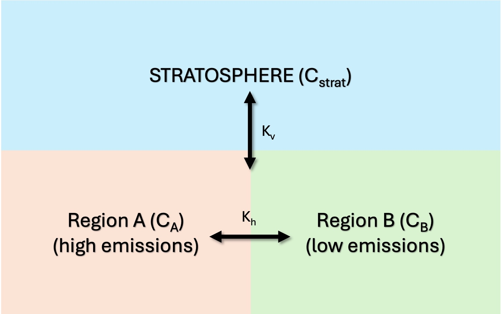

# Physical Interpretation of the Model

This project implements a simplified, physically motivated toy model to explore how solar radiation modification (SRM), specifically stratospheric aerosol injection (SAI), can influence air quality and its controllability by emissions. While the model is intentionally reduced in complexity, it captures the essential processes that govern pollutant transport and removal in the atmosphere and provides insight into how large-scale circulation changes may affect surface pollution.

---

## Conceptual Framework

The atmosphere is represented using a minimal three-component system:

- Region A (troposphere): a high-emission region (e.g. industrialised area)
- Region B (troposphere): a lower-emission region (e.g. cleaner or downwind region)
- Stratosphere: a reservoir that mediates large-scale vertical transport

The model tracks the concentration of a generic pollutant $C$ in each of these components. The pollutant evolves due to three key processes:

1. Emissions (source)
2. Removal (sink)
3. Transport (redistribution)

These are combined into a governing equation of the form:

```math
\frac{dC}{dt} = E - \lambda C + \text{Transport}
```

where:

- $E$ is the emission rate
- $\lambda$ is the removal rate
- Transport includes both horizontal and vertical exchange

---

## Model Geometry and Transport Processes

The system can be visualised as follows:



### Horizontal Transport ($k_h$)

- Represents mixing between Region A and Region B
- Captures cross-boundary pollution
- Governs how emissions in one region affect another

```math
T_h = k_h (C_{\text{other}} - C)
```

---

### Vertical Transport ($k_v$)

- Represents exchange between the troposphere and stratosphere
- Acts as a proxy for large-scale circulation such as Brewer-Dobson circulation and stratosphere-troposphere exchange

```math
T_v = k_v (C_{\text{strat}} - C)
```

---

## Role of SRM (SAI)

The central idea of the model is that SRM does not directly change emissions, but instead modifies atmospheric transport.

Stratospheric aerosol injection introduces particles into the stratosphere, which:

- absorb and scatter radiation
- alter temperature gradients
- modify atmospheric circulation

In this model, these effects are represented as a perturbation to transport coefficients:

```math
k = k_{\text{base}} \left(1 + \alpha \cdot \mathrm{SAI\_strength}\right)
```

where:

- $k_{\text{base}}$ is the baseline transport rate
- $\alpha$ is a sensitivity parameter
- $\mathrm{SAI\_strength}$ represents the intensity of SRM

A negative $\alpha$ corresponds to reduced mixing, which is physically plausible if stratospheric heating stabilises atmospheric layers or alters circulation patterns.

---

## Meaning of Model Parameters

### Emissions

- $E_A$: emissions in Region A
- $E_B$: emissions in Region B

These are control variables, representing human-driven pollution sources.

---

### Removal Rate ($\lambda$)

- Represents loss processes such as deposition and chemical reactions
- Acts as a linear decay:

```math
R = -\lambda C
```

---

### Transport Coefficients

- $k_h$: horizontal mixing (A ↔ B)
- $k_v$: vertical exchange (troposphere ↔ stratosphere)

These determine how quickly pollutants redistribute spatially.

---

### SRM Parameters

- `SAI_strength`: magnitude of geoengineering forcing
- $\alpha_{\text{vertical}}$, $\alpha_{\text{horizontal}}$: sensitivity of transport to SRM

These encode how strongly SRM alters circulation.

---

### Initial Conditions

- $C_A^0$, $C_B^0$, $C_{\text{strat}}^0$: starting concentrations

These determine transient behaviour but not long-term steady state.

---

## What the Model Demonstrates

### 1. Emissions-Concentration Relationship

The model explicitly links emissions to concentrations:

- Increasing emissions leads to higher pollutant levels
- Redistribution depends on transport

---

### 2. Cross-Boundary Pollution

Pollution from Region A can spread to Region B via horizontal mixing:

- Strong mixing leads to a shared pollution burden
- Weak mixing leads to more localised pollution

---

### 3. Role of the Stratosphere

The stratosphere acts as:

- a buffer
- a pathway for long-range transport

Changes in vertical exchange affect:

- pollutant lifetime
- redistribution patterns

---

### 4. Impact of SRM on Air Quality

The key insight of the model is:

SRM modifies transport, which in turn alters how emissions translate into air quality.

This leads to the central quantity of interest:

```math
\text{Sensitivity} = \frac{dC}{dE}
```

This measures air quality controllability:

- High sensitivity means emissions strongly affect pollution, so air quality is easier to regulate
- Low sensitivity means a weaker response, so pollution is harder to control

---

### 5. Policy-Relevant Insight

Even in this simple model, SRM can:

- change transport pathways
- alter regional pollution distribution
- modify cross-border pollution flows

This means:

- countries may experience different air quality outcomes under SRM
- local emission controls may become more or less effective

---

## Summary

This toy model serves as a conceptual bridge between:

- full chemistry-climate models (e.g. UKCA, WACCM)
- simplified, interpretable systems

It demonstrates that:

- atmospheric transport is central to air quality
- SRM influences transport, not just temperature
- this can fundamentally alter how emissions affect pollution

Despite its simplicity, the model captures a key research question:

How does geoengineering affect our ability to control air quality?
